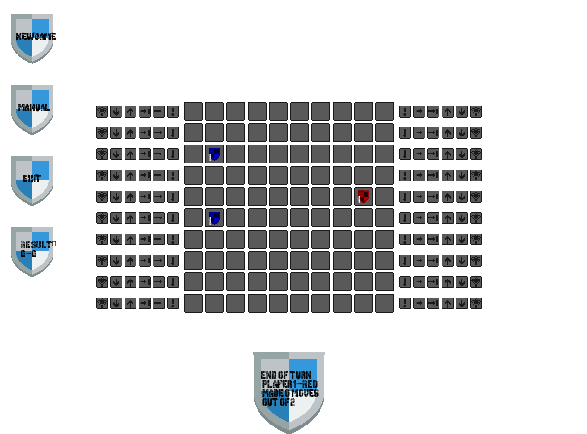

# TurnBasedBoardGameInSFML
This is an original turn based game for 2 players (offline, no online version implemented yet).  
It was implemented as a project for Computer Programming 3 Course at Silesian University of Technology.

Whole game rules manual is located at /SFML/shared/MANUAL.txt

To create graphic interface i used SFML library.

Format: 
